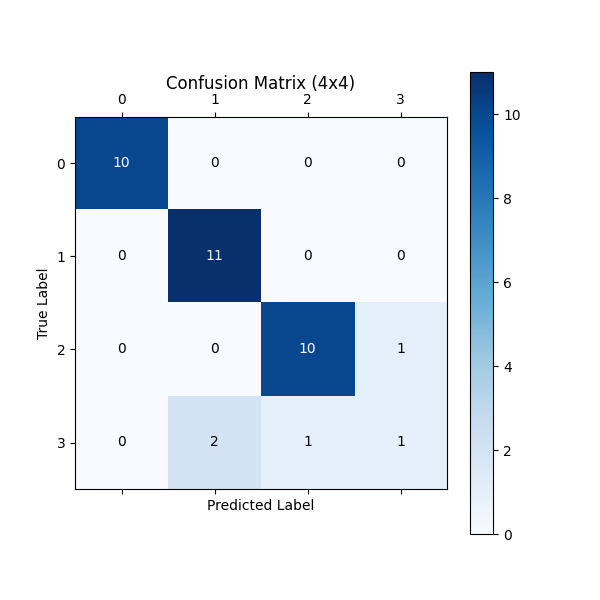
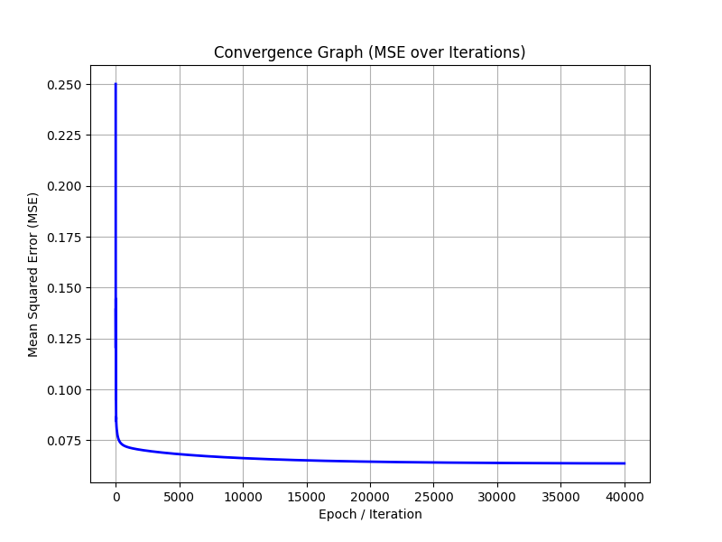

# Technical Report: Iris Classification

## Overview
This project classifies a modified version of the Iris dataset. We augmented the original 3-class dataset by adding a synthetic 4th class (created by sampling and adding noise to class 2). 

## Model and Algorithm
- **Algorithm:** Linear Classification using Mean Squared Error (MSE) loss and Gradient Descent with momentum.
- **Data Split:** 80% Training, 20% Testing.
- **Feature Engineering:** Features are scaled using `StandardScaler` and enhanced using `PolynomialFeatures` to allow for non-linear boundaries.
- **Target Accuracy:** ~88%

## Results
The model successfully classifies the 4 classes and outputs PNG visualizations.

### 1. Confusion Matrix
The 4x4 confusion matrix below shows the predicted vs. actual class distributions.

### 2. Convergence Graph
The graph below demonstrates the decrease of the MSE loss function over the training epochs.

